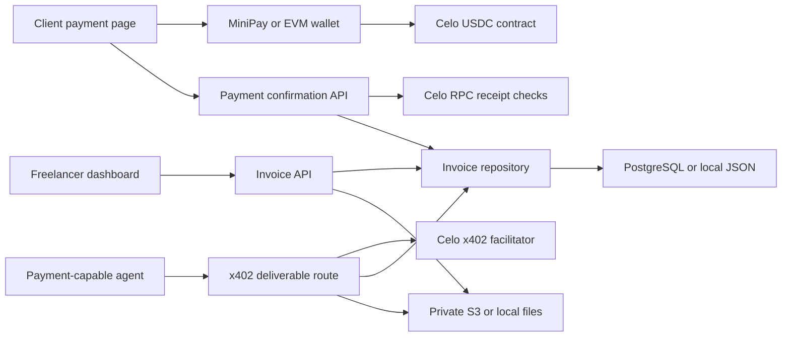

# Architecture

TendaPay is a Next.js application with a small domain layer and server-side
adapters for persistence, Celo verification, file storage, and x402 settlement.

## Main boundaries

| Area | Location | Responsibility |
| --- | --- | --- |
| Domain | `src/domain/invoice.ts` | Schemas, types, totals, and invoice status rules. |
| Dashboard | `src/components/dashboard/` | Invoice creation and freelancer activity. |
| Client flow | `src/components/client/` | Wallet payment, milestone state, and downloads. |
| Celo client | `src/lib/celo.ts` | Wallet connection, USDC transfer, and attribution. |
| Verification | `src/lib/server/payment-verifier.ts` | Independent on-chain receipt validation. |
| Persistence | `src/lib/server/*-invoice-repository.ts` | PostgreSQL and local repository adapters. |
| Files | `src/lib/server/deliverable-storage.ts` | Private S3-compatible or safe local storage. |
| HTTP routes | `src/app/api/` | Validation, status codes, and response shaping. |

## Browser payment sequence

1. The client opens an unguessable invoice URL and chooses the next unpaid
   milestone.
2. The wallet switches to Celo and transfers the exact six-decimal USDC amount
   directly to the freelancer wallet.
3. The transaction data includes an ERC-8021 attribution suffix.
4. The server retrieves the transaction and receipt from Celo.
5. The verifier checks successful execution, USDC contract, `transfer` call,
   recipient, amount, and previous use of the hash.
6. The repository records settlement and releases the milestone deliverable.

## Agent payment sequence

The x402 route prices a protected file at the milestone amount and names the
freelancer wallet as `payTo`. The facilitator verifies and settles the payment.
Only then does TendaPay record the receipt and return the file.

The configured server wallet signs facilitator requests. It is not the payment
recipient and does not custody freelancer funds.

## Data model

An invoice owns one or more milestones and an activity log. A milestone carries
its amount in integer cents, due date, settlement state, optional receipt data,
and optional protected-file metadata. Currency is fixed to USDC in the MVP.

When `DATABASE_URL` is configured, invoices are stored as validated JSONB
records inside PostgreSQL transactions. A dedicated settlement table enforces
transaction-hash uniqueness across invoices. Invoice numbers come from a
database sequence, so concurrent application instances cannot issue the same
number.

Without `DATABASE_URL`, local repository writes are serialized and persisted
through a temporary-file rename. This prevents overlapping requests from
writing partial JSON and keeps development zero-config.

When `S3_BUCKET` is configured, deliverables are read and written through the
private S3 API. Otherwise files remain under `.data/uploads`. Database and file
adapters can be enabled independently, though deployed environments should use
both production adapters.

## Security properties

- Server-side validation uses Zod at API and persistence boundaries.
- Payment confirmation does not trust the payer's submitted amount or address.
- A transaction hash cannot settle more than one milestone.
- File names are normalized and storage paths are checked against traversal.
- Downloads use `private, no-store` and remain unavailable before release.
- Simulated transaction references are rejected in production.

The MVP does not include authentication. Invoice URLs are capability links and
should be treated as sensitive.
